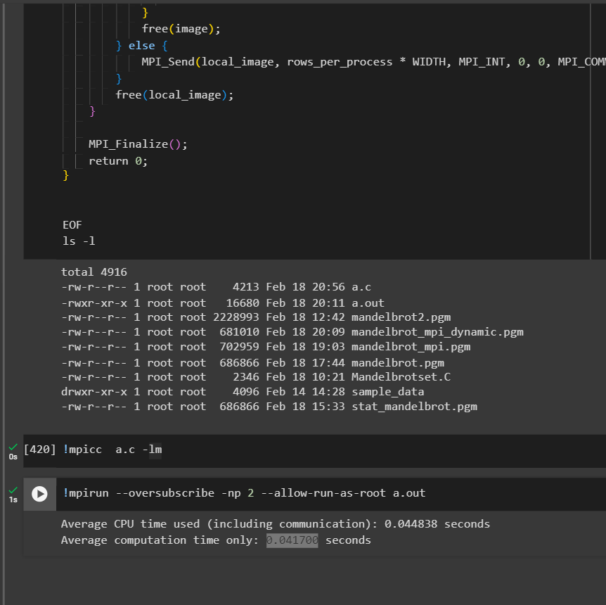
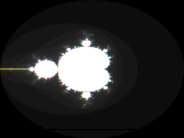

# Parallelizing-Mandelbrot set
Tamer kobba
202104873

# Introduction
The Mandelbrot set is a fractal defined by iterating a complex function \( z_{n+1} = z_n^2 + c \), where \( z \) and \( c \) are complex numbers. If the iterated function remains bounded for all n , the point \( c \) belongs to the Mandelbrot set; otherwise, it diverges.

Equation: 
 z_{n+1} = z_n^2 + c 

Condition: 
|z_n|^2 ≤ 4 


# How we parallelized the Problem

The Mandelbrot set is particularly convenient t parallelize for a message passing system because each pixel can be computed without any information about the surrounding pixels.
When parallelizing the computation of the Mandelbrot set, we employed two distinct approaches to distribute the workload among multiple processes using MPI
## Static
each MPI process is responsible for a fixed portion of the grid, and the workload is evenly divided among processes. The results are gathered at the end for image generation.

-Pseudo code:
```python
  Master Process (Pmaster):
Calculate rows_per_process = HEIGHT / num_proc.
Calculate remainder_rows to distribute the remaining rows evenly
For each process (Pi) except the master:
    Calculate the starting row (start_row) for Pi.
    Calculate the ending row (end_row) for Pi based on rows_per_process.

Initialize an empty image array to collect results.
Collect results from all slave processes:
    For each slave process:
        Receive a message containing the portion of the Mandelbrot set computed by the slave.
        Extract the starting row index from the received message to identify where this portion fits in the final image array.
        Store the received portion in the appropriate place in the final image array.

Save the collected image using save_pgm.

Slave Process (Pslave):
Based on the received rank, calculate the assigned rows to compute (start_row to end_row).

    For each row assigned:
        For each pixel (x) in the row:
            Calculate the complex coordinates (c.real, c.imag) based on the pixel's x-coordinate and the row number.
            Compute the color for the pixel using cal_pixel(c) and store it in a local part of the image.

Send the computed local image part along with its starting row index back to the master process using MPI_Send.
```

## Dynamic
The dynamic approach on the other hands has initially each slave process is given a row to compute. As soon as a process finishes computing its assigned row and sends the result back to the master it is immediately assigned a new row to work on. This process repeats until all rows have been computed. The dynamic method ensures that all processes are kept busy as much as possible dynamically redistributing work based on process availability.
This could perform better than the static approach since here we aim to minimize idle time for processors.
-Pseudo code:
  ```python
  Master Process (P_master):

Initialize an empty 2D array image[HEIGHT][WIDTH] to store the final result.
Send the first batch of row numbers to each slave process, marking the start of their workload.

While there are rows left to assign:
    Receive a completed row from any slave process along with the row index.
    Update the image array with the received row at the correct index.
    Send a new row number to the slave process that just completed work, if any rows remain.

After all rows are assigned and received, send a termination signal to all slave processes
Save the final image using save_pgm.

Slave Process (P_slave):
Receive the initial row number from the master process.
While not receiving a termination signal:
  For each assigned row:
    For each pixel in the row:
      Calculate the complex coordinates (c.real, c.imag) based on the pixel's coordinates.
      Compute the color for the pixel using cal_pixel(c) and store it in a local array.
    Send the computed row along with its index back to the master process.
    Wait for the next row number or a termination signal from the master process.
```
# Setup:
I used google colab to run the MPI programs for the Mandelbrot Set



# Code
[https://github.com/Tamerkobba/Parallelizing-mandelbrotset-using-MPI](https://github.com/Tamerkobba/Parallelizing-mandelbrotset-using-MPI)

# Performance
## Sequential
Best sequential execution time=0.076644s
## Static
### Speed up factor
$S(2)=0.076644/0.044838 8=1.709$
$S(4)=0.076644/0.040987 =1.8699$
$S(8)=0.076644/0.031549=2.429$
$S(16)=0.076644/0.018901=4.055$
$S(32)=0.076644/0.009695=7.9055$
$S(64)=0.076644/0.005576=13.7453$
$S(128)=0.076644/0.003884=19.733$
$S(256)=0.076644/0.004755=16.1186$
### Efficiency
$Efficiency(E) = $Execution time using one processor/ Execution time using a multiprocessor x number of processors

| Processors | Speedup  | Efficiency (%)    |
|------------|----------|-------------------|
| 2          | 1.709    | 85.467%           |
| 4          | 1.8699   | 46.7475%          |
| 8          | 2.429    | 30.3625%          |
| 16         | 4.055    | 25.34375%         |
| 32         | 7.9055   | 24.7046875%       |
| 64         | 13.7453  | 21.47703125%      |
| 128        | 19.733   | 15.41640625%      |
| 256        | 16.1186  | 6.296328125%      |
### Computation to communication ratio
| Number of processors |Total Speed in seconds | Computation time(without communication)|
|----------------------|-----------------------|----------------------------------------|
|          2           |  0.044838             |   0.041700                             |
|          4           |  0.040987             |   0.002388                             |
|          8           |  0.031549             |   0.001105                             |
|          16          |  0.018901             |   0.000533                             |
|          32          |  0.009695             |   0.000245                             |
|          64          |  0.005576             |   0.000132                             |
|          128         |  0.003884             |   0.000067                             |
|          256         |  0.004755             |   0.000036                             |


| Number of processors | Computation/Communication ratio | 
|----------------------|---------------------------------|
|          2           |  0.93                           |
|          4           |  0.5826                         |
|          8           |  0.03502                        |
|          16          |  0.02819                        |
|          32          |  0.2527                         |
|          64          |  0.236728                       |
|          128         |  0.017250                       |
|          256         |  7.57x10^-3                     |


The computation to communication ratio for the dynamic parallelization of the Mandelbrot set decreases significantly with the increase in the number of processors, indicating a rise in communication overhead relative to computation time. Particularly, the ratio shows a substantial drop as we move from 2 to 256 processors, with the lowest ratios observed at the highest processor counts. This trend suggests that while parallelization reduces total computation time, the cost of communication becomes more pronounced with more processors involved. This trend highlights the importance of carefully balancing computation and communication in the design of parallel algorithm

### Scalability
                           |


Looking at the results of our parallel algorithm up to 256 processors reveals a pattern of increasing speedup with an initial rise in processor count, peaking at 128 processors before slightly declining at 256 processors. However, efficiency significantly decreases as more processors are added, starting strong at 82.535% with 2 processors and plummeting to 6.296% with 256 processors. This indicates that while the algorithm benefits from parallelization initially, its scalability is limited by diminishing efficiency at higher processor counts.

## Dynamic
### Speed up factor
$S(2)=0.076644/0.099608=0.7694$
$S(4)=0.076644/0.029533=2.595$
$S(8)=0.076644/0.00386=19.855$
$S(16)=0.076644/0.002622=29.2311$
$S(32)=0.076644/0.0026225=29.225$
$S(64)=0.076644/0.00239=32.068$
$S(128)=0.076644/0.002285=33.5422$
$S(256)=0.076644/0.00194=39.507$
### Efficiency
$Efficiency(E) = $Execution time using one processor/ Execution time using a multiprocessor x number of processors

| Number of Processors | Speedup   | Efficiency (%)  |
|----------------------|-----------|-----------------|
| 2                    | 0.7694    | 38.47           |
| 4                    | 2.595     | 64.875          |
| 8                    | 19.855    | 248.1875        |
| 16                   | 29.2311   | 182.694375      |
| 32                   | 29.225    | 91.328125       |
| 64                   | 32.068    | 50.10625        |
| 128                  | 33.5422   | 26.20484375     |
| 256                  | 39.507    | 15.432421875    |


## Computation to communication ratio

## Scalability
| Number of processors | Speed in seconds | 
|----------------------|------------------|
|          2           |  0.099608        |
|          4           |  0.029533        |
|          8           |  0.011122        |
|          16          |  0.00386         |
|          32          |  0.002622        |
|          64          |  0.00239         |
|          128         |  0.002285        |
|          256         |  0.00194         |


We notice as we increase we increase the number of processors it benefits in terms of speed up.However, the efficiency significantly decreases with higher processor counts, particularly beyond 32 processors, suggesting diminishing returns on scalability.

# Discussion and Conclusions

We saw both approaches generally lead to better speeds compared to the sequential to varying degrees of speedup. Static implementation while straightforward lead to suboptimal performance due to fixed process assignments, potentially leaving some processors idle even when optimizing this approach by sending back the results from the slave to the master as an array instead of one pixel at a time to reduce communication overhead it didn't perform as well as the dynamic implmentation. In contrast The dynamic approach was notable to achieving superlinear speedup for when processors where between 8 and 16 counterintuitive result can be attributed to factors such as improved cache utilization and dynamic load balancing, which optimizes processor usage by distributing workloads more effectively across processors.This was because dynamic load balancing adapts to the varying computational demands of each task and the differing speeds of processors ensuring a more efficient utilization of resources by assigning tasks to processors as they become available. As the number of processors increases, however, efficiency naturally declines due to the overhead associated with managing more parallel tasks and communication. Nonetheless, the scalability of the dynamic approach is evident, with substantial reductions in computation time as more processors are employed, underscoring the benefits of dynamic workload distribution in parallel computing environments.